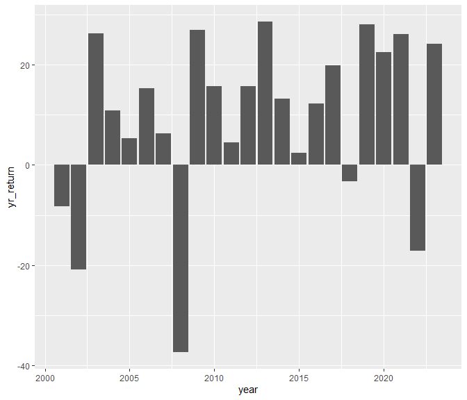

wk2-workshop
================
o’rianna
2024-01-24

``` r
data = readRDS("data/wk2_stocks.rds")
str(data)
```

    ## 'data.frame':    5798 obs. of  4 variables:
    ##  $ SPY_prices : num  88.1 87.1 84.3 84.9 84.7 ...
    ##  $ SPY_returns: num  0.04804 -0.01076 -0.03264 0.00774 -0.00264 ...
    ##  $ SPY_vol    : num  88.1 87.1 84.3 84.9 84.7 ...
    ##  $ date       : Date, format: "2001-01-03" "2001-01-04" ...

\##statistics on returns

``` r
cumulative_returns = sum(data$SPY_returns) *100
cumulative_returns
```

    ## [1] 218.3304

``` r
average_return = mean(data$SPY_returns) *100
average_return
```

    ## [1] 0.03765616

``` r
standard_deviation = sd(data$SPY_returns) *100
standard_deviation
```

    ## [1] 1.221943

- The cumulative returns of the S&P index during this period is
  218.3303882%.

- The average daily returns of the S&P index during this period is
  0.0376562%.

- The standard deviation of the daily returns of the S&P index during
  this period is 1.2219427%.

\##S&P Prices

``` r
#install.packages("tidyverse")
library(tidyverse)
```

    ## ── Attaching core tidyverse packages ──────────────────────── tidyverse 2.0.0 ──
    ## ✔ dplyr     1.1.4     ✔ readr     2.1.5
    ## ✔ forcats   1.0.0     ✔ stringr   1.5.1
    ## ✔ ggplot2   3.4.4     ✔ tibble    3.2.1
    ## ✔ lubridate 1.9.3     ✔ tidyr     1.3.0
    ## ✔ purrr     1.0.2     
    ## ── Conflicts ────────────────────────────────────────── tidyverse_conflicts() ──
    ## ✖ dplyr::filter() masks stats::filter()
    ## ✖ dplyr::lag()    masks stats::lag()
    ## ℹ Use the conflicted package (<http://conflicted.r-lib.org/>) to force all conflicts to become errors

``` r
ggplot(data = data, aes(x = date, y = SPY_prices)) +
  geom_line()
```

<!-- --> \##S&P
Yearly Returns

``` r
data %>%
  mutate(year = year(date)) %>%
  filter(year>= 2001 & year <= 2023) %>%
  group_by(year) %>%
  summarize(yr_return = sum(SPY_returns)*100) %>%
  ggplot(aes(x = year, y = yr_return)) +
  geom_col()
```

<!-- -->
